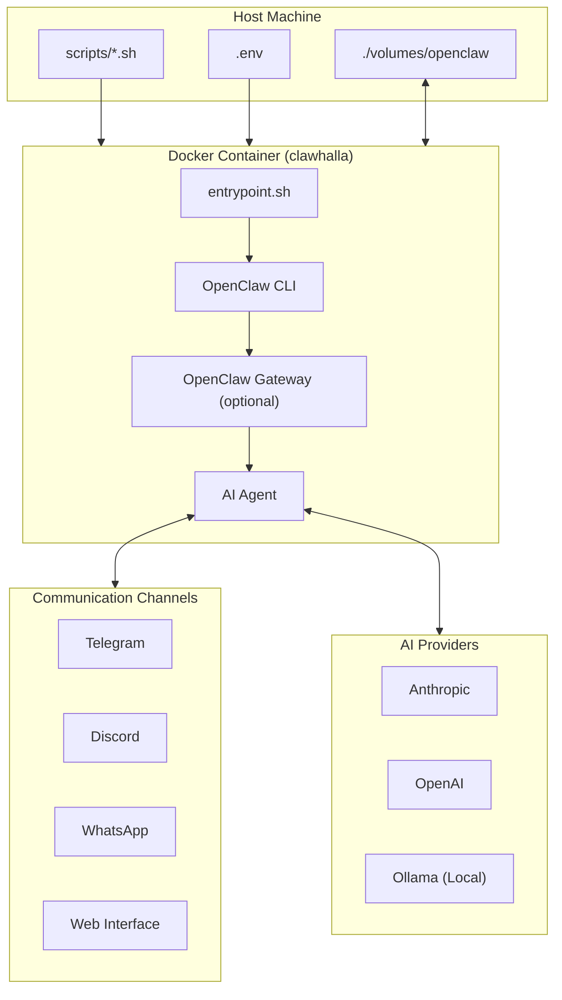

# ClawHalla Architecture

## Overview



## Components

### Host side

- `scripts/*.sh`: user-facing commands (start/stop/reset)
- `.env`: environment configuration (API keys, gateway token)
- `volumes/openclaw/`: persistent OpenClaw data

### Container side

- `docker/entrypoint.sh`: creates directories and fixes permissions
- OpenClaw CLI: onboarding and configuration
- OpenClaw Gateway: runs the API/webchat when you decide to start it

## Data flow

1. Run `scripts/start.sh`
2. Docker Compose builds/starts the container
3. Entrypoint initializes directories inside the mounted volume
4. Container keeps running (default `sleep infinity`)
5. Run onboarding inside the container: `openclaw onboard`
6. Start the gateway when needed: `openclaw gateway`

## Volume architecture

```text
Host: ./volumes/openclaw/
  |
  v
Container: /home/clawdbot/.openclaw/
  |
  +-- identity/
  +-- agents/
      +-- main/
          +-- agent/
          +-- sessions/
```

## Security considerations

- No ports are exposed by default.
- If you expose the gateway, bind to `127.0.0.1` only.
- Sensitive values should come from environment variables.
